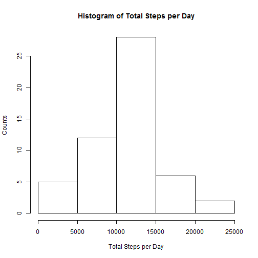
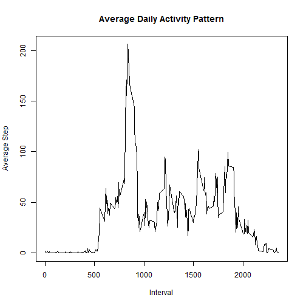
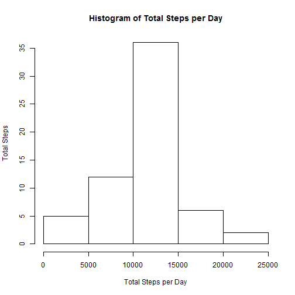
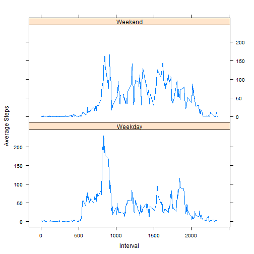

This is an R Markdown document for course project of Reproducible Research. Each step required by the assignment including detailed R codes and outcomes is documented in this markdown file.  

###Loading and PreProcessing the Data

First, set the working directory to the one where required data is downloaded and unzipped at. Load data into R and convert Date from character to proper data format. R codes as below:


```r
activity <- read.csv("activity.csv", stringsAsFactors = FALSE)
activity$date <- as.Date(activity$date)
```

Here is what the data look like:


```r
head(activity)
```

```
##   steps       date interval
## 1    NA 2012-10-01        0
## 2    NA 2012-10-01        5
## 3    NA 2012-10-01       10
## 4    NA 2012-10-01       15
## 5    NA 2012-10-01       20
## 6    NA 2012-10-01       25
```


###What is mean total number of steps taken per day?

1. Calculate the toal number of steps taken per day

To calculate the total steps per day, we need to remove NA data first, then sum the steps grouped by date. Dplyr package is required in this step. 


```r
library(dplyr)
```

```
## 
## Attaching package: 'dplyr'
## 
## The following objects are masked from 'package:stats':
## 
##     filter, lag
## 
## The following objects are masked from 'package:base':
## 
##     intersect, setdiff, setequal, union
```

```r
activity_nona <- na.omit(activity) 
activity_sum <- activity_nona %>% group_by(date) %>% summarise(total_steps = sum(steps))
```

2. Make a histogram of the total number of steps taken each day


```r
hist(activity_sum$total_steps,xlab = "Total Steps per Day", ylab = "Counts", main = "Histogram of Total Steps per Day")
```

 

3. Calculate and report the mean and median of the total number of steps taken per day

R codes and outcomes as below:


```r
activity_mean <- mean(activity_sum$total_steps)
activity_median <- median(activity_sum$total_steps)
print(activity_mean)
```

```
## [1] 10766.19
```

```r
print(activity_median)
```

```
## [1] 10765
```

The mean of total steps is 10766.19 and the median is 10765.


###What is the average daily activity pattern?

1. Time series plot of 5-min interval and average number of steps taken across all days

First, we need to group data by interval; then calculate the average steps for each interval across all days. R codes and plot as below:


```r
activity_pat <- activity_nona %>% group_by(interval) %>% summarise(avg_steps = mean(steps))

plot(x=activity_pat$interval, y = activity_pat$avg_steps, type = "l", xlab = "Interval", ylab = "Average Step", main = "Average Daily Activity Pattern")
```

 

2. Which 5-minute interval has the maxium average number of steps?

To get required interval we need to subset the data to get the maxium average number of steps. R codes shown as below:


```r
maxInterval <- subset(activity_pat, activity_pat$avg_steps == max(activity_pat$avg_steps))
print(maxInterval)
```

```
## Source: local data frame [1 x 2]
## 
##   interval avg_steps
##      (int)     (dbl)
## 1      835  206.1698
```

The 835 interval has the mxium average number of steps.


###Imputing missing values

1. Calculate and report the taol number of missing values in the dataset**

Use complete.cases function to accomplish this step. R codes and answer shown below:


```r
missingdata <- subset(activity, !complete.cases(activity))
missingnum <- nrow(missingdata)
print(missingnum)
```

```
## [1] 2304
```

There are 2304 missing values in the original dataset.


2. Impute missing values

it is assumed that the indiviaul has same number of steps for each 5-minute interval across days. So I use the average number of steps for each interval across days to fill in the missing value.

Since we already calculated the average number of steps for each interval (data frame activity_pat). We will just fill the missing values using activity_pat. I joined the missing value data set with activity_pat. 

R codes below:


```r
filleddata <- merge(x=missingdata, y=activity_pat, by.x = "interval", by.y = "interval", all.x = TRUE) %>% select(4, 3, 1) %>% arrange(date, interval)
names(filleddata)[1] <- "steps"
```

Here is what the filled data look like:


```r
head(filleddata)
```

```
##       steps       date interval
## 1 1.7169811 2012-10-01        0
## 2 0.3396226 2012-10-01        5
## 3 0.1320755 2012-10-01       10
## 4 0.1509434 2012-10-01       15
## 5 0.0754717 2012-10-01       20
## 6 2.0943396 2012-10-01       25
```


3. Create a new dataset with full data

Combine the data frame with NA values removed and the data frame just created filled with assumed data values. To make the data organized, sort it by date and interval. 

R codes below:


```r
activity_filled <- rbind(activity_nona, filleddata) %>% arrange(date, interval)
```

Baisc summary of the filled activity data frame:


```r
str(activity_filled)
```

```
## 'data.frame':	17568 obs. of  3 variables:
##  $ steps   : num  1.717 0.3396 0.1321 0.1509 0.0755 ...
##  $ date    : Date, format: "2012-10-01" "2012-10-01" ...
##  $ interval: int  0 5 10 15 20 25 30 35 40 45 ...
##  - attr(*, "na.action")=Class 'omit'  Named int [1:2304] 1 2 3 4 5 6 7 8 9 10 ...
##   .. ..- attr(*, "names")= chr [1:2304] "1" "2" "3" "4" ...
```


4. Make a histogram of total number of steps taken per day using the complete filled data set. Calculate and report the mean and median of the new data set. 

First, create a new data frame named "activity_sum1" for total number of steps per day. Then plot it with the "hist" function. R codes below:


```r
activity_sum1 <- activity_filled %>% group_by(date) %>% summarise(sum_steps = sum(steps))

head(activity_sum1)
```

```
## Source: local data frame [6 x 2]
## 
##         date sum_steps
##       (date)     (dbl)
## 1 2012-10-01  10766.19
## 2 2012-10-02    126.00
## 3 2012-10-03  11352.00
## 4 2012-10-04  12116.00
## 5 2012-10-05  13294.00
## 6 2012-10-06  15420.00
```

Histogram plot: 


```r
hist(x=activity_sum1$sum_steps, xlab = "Total Steps per Day", ylab = "Total Steps", main = "Histogram of Total Steps per Day")
```

 

Mean and median for the total number of steps shown below:


```r
activity_mean1 <- mean(activity_sum1$sum_steps)
activity_median1 <- median(activity_sum1$sum_steps)
print(activity_mean1)
```

```
## [1] 10766.19
```

```r
print(activity_median1)
```

```
## [1] 10766.19
```

The new mean is the same as old mean both are 10766.19

The new median is different from the old one, the new one is 10766.19 and the old one is 10765. 

Imputing missing data will affect the median of data but not on the mean. 


###Difference in activity patterns between weekdays and weekends

1. Create new factor variable "weekday" and "weekend"

First identify the date for weekdays (i.e. Monday, Tuesday, etc.) using "weekdays" function. Then using ifelse function to categorize into two levels - "Sunday" and "Saturday" will be "Weekend"; the others will be "Weekday". R codes shown below:


```r
wend <- c("Saturday", "Sunday")
activity_pat1 <- activity_filled %>% mutate(wdays = as.factor(ifelse(weekdays(activity_filled$date, abbreviate = FALSE) %in% wend, "Weekend", "Weekday")))
```

The first 6 rows of the new data frame looks like below:


```r
head(activity_pat1)
```

```
##       steps       date interval   wdays
## 1 1.7169811 2012-10-01        0 Weekday
## 2 0.3396226 2012-10-01        5 Weekday
## 3 0.1320755 2012-10-01       10 Weekday
## 4 0.1509434 2012-10-01       15 Weekday
## 5 0.0754717 2012-10-01       20 Weekday
## 6 2.0943396 2012-10-01       25 Weekday
```


2. Mark a panel plot to show everage number of steps for each interval between weekends and weekdays

Summarize the step values by weekends and interval, calculate the mean of steps. To plot a time series panel plot, use lattice plotting system:


```r
activity_pat1 <- activity_pat1 %>% group_by(wdays, interval) %>% summarise(avg_step = mean(steps))

library(lattice)
g <- xyplot(avg_step ~ interval | wdays, data = activity_pat1, layout = c(1,2), type = "l", xlab = "Interval", ylab = "Average Steps")

print(g)
```

 


